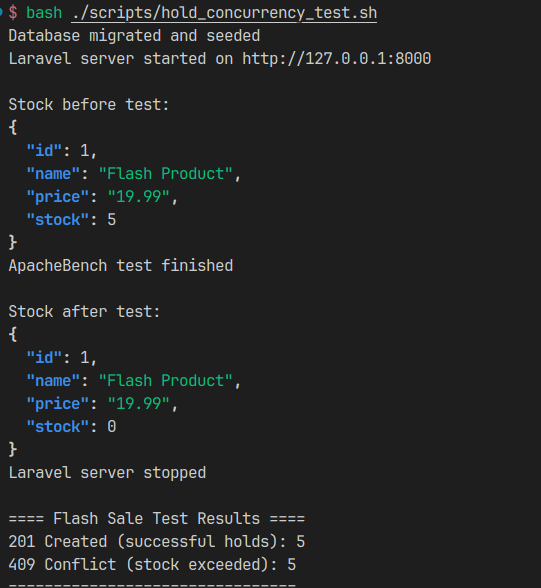

# Flash-Sale-Checkout

This project is Laravel-based application designed to handle flash sale checkouts. 

## Requirements
- PHP 8.2+
- Composer
- Laravel 12
- MySQL 8+
- docker-compose 

## Installation

1. Clone the repository:
   ```bash
   git clone git@github.com:ahmedaliv/Flash-Sale-Checkout.git
    cd Flash-Sale-Checkout
    ```
2. Install dependencies:
    ```bash
    composer install
    ```
3. Copy the example environment file and configure your environment variables:
    ```bash
    cp .env.example .env
    ```
    Update the `.env` file with your database and other configurations. (the .env.example is already configured for docker setup)
4. Generate an application key:
    ```bash
    php artisan key:generate
    ```
5. Start the Database using Docker:
    ```bash
    docker-compose up -d
    ```
6. Run migrations and seed the database:
    ```bash
    php artisan migrate --seed
    ```

7. Start the development server:
    ```bash
    php artisan serve
    ```
8. Access the application at `http://localhost:8000`.


## API Endpoints
 - `GET /api/v1/products/{id}`: Retrieve product details by ID.
 - `POST /api/v1/holds`: Create a hold on a product.
 - `POST /api/v1/orders`: Create an order for a held product.
 - `POST /api/v1/payments/webhook`: Handle payment gateway webhooks.

## Assumptions and Invariants
- Hold Rules: 
  - Holds expire automatically after (~2 minutes) if not converted to an order.
  - Hold cannot be used twice 
  - Holds cannot be used after expiration.
- Order Rules:
    - Orders can only be created for valid, unexpired holds.
    - Once an order is created, the associated hold is considered used and cannot be reused.
- Webhook Rules:
    - Idempotent via unique Idempotent key.
    - Out Of Order Safe (handled by saving it as pending and processing when its related order is created).
## Concurrency Handling
 - Used database transactions and `SELECT ... FOR UPDATE` to lock rows when modifying stock.
 - Used Background Jobs to automatically release expired holds (created when the hold is created).
 - Used Caching for reads and also handled its invalidation on writes (to avoid stale data).
## Logging
 - Added Logs for Hold Operations (creation, expiration, usage), Order Operations, and Payment Webhook Processing.
 - can be found in `storage/logs/laravel.log`
 - if in linux you can use `tail -f storage/logs/laravel.log` to see it live.

## Testing

- ### Added Automated Tests:
    - To run all tests: `php artisan test`
    - To run specific tests, use the `--filter` option with the test class name.
 - ### Key Test Cases:
    - Hold expiry returns available stock. (Can be found in `tests/Feature/HoldExpirationTest.php` and run using `php artisan test --filter=HoldExpirationTest`)
    - Webhook Idempotency. (Can be found in `tests/Feature/WebhookIdempotencyTest.php` and run using `php artisan test --filter=WebhookIdempotencyTest`)
    - Webhook arriving before order creation. (Can be found in `tests/Feature/WebhookBeforeOrderTest.php` and run using `php artisan test --filter=WebhookBeforeOrderTest`)
    - Parallel hold attempts at a stock boundary (no over selling)
        (Can be found in `tests/Feature/HoldConcurrencyTest.php` and run using `php artisan test --filter=HoldConcurrencyTest`)
    - Parallel Hold Test (Personal Note): I tried implementing the parallel hold test fully inside Laravel, but it was tricky. I had to research and ended up forking a process to simulate multiple requests at the same time. To make it easier, I also added a separate script using Apache Bench (ab) outside Laravel’s testing framework. You can find it at scripts/hold_concurrency_test.sh.

        To run it:

        Make sure Apache Bench (ab) is installed.

        Run `bash scripts/hold_concurrency_test.sh`

        This script will:

        Reset the database and run seeders

        Serve the Laravel app

        Send 10 concurrent requests to create holds on product with ID 1 (stock = 5)

        Finally, check how many holds were successfully created

        Expected result: Only 5 holds succeed, leaving stock at 0.

        #### Demo Screenshot:


        
